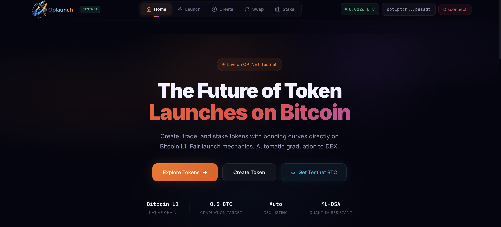
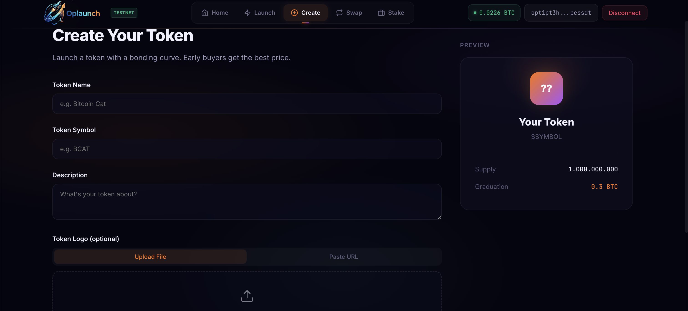
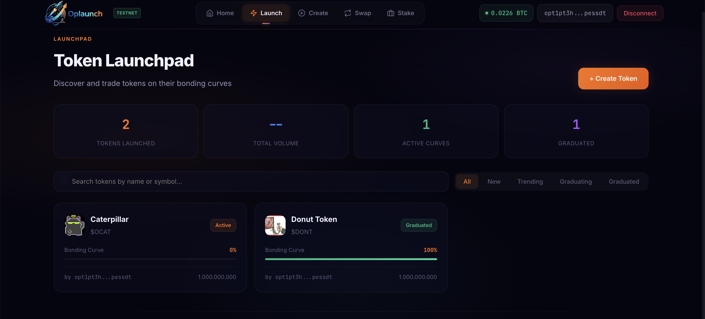
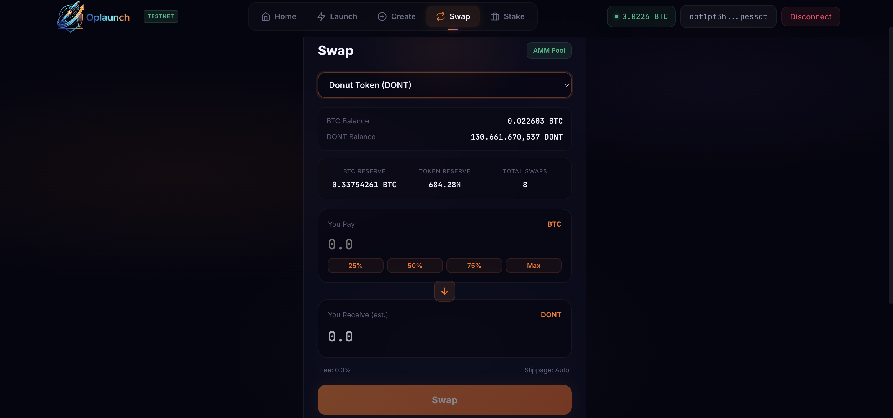

# OpLaunch - DeFi Launchpad on Bitcoin L1

   

**The first fully functional token launchpad on Bitcoin L1.**

OpLaunch is a full-stack DeFi platform built on **Bitcoin Layer 1** using [OP_NET](https://opnet.org). It combines a token launchpad with bonding curves, a DEX for graduated tokens, staking vaults, and an integrated **Bob AI** assistant — all powered by real on-chain smart contracts.

**Live Demo:** [https://oplaunch.cc](https://oplaunch.cc)

## Features

- **Token Launchpad** — Anyone can create an OP_20 token with a bonding curve. Each token gets its own real smart contracts deployed on Bitcoin L1.
- **Bonding Curve Trading** — Buy and sell tokens on a constant-product AMM curve (x*y=k). 0.3% trading fee.
- **Auto-Graduation** — When a token's curve accumulates 0.3 BTC, it automatically graduates to the DEX.
- **DEX (AMM)** — Graduated tokens trade on an on-chain AMM pool with standard swap mechanics.
- **Staking Vaults** — Each graduated token gets its own StakingVault contract with block-based reward distribution.
- **Escrow System** — BTC payments go through an escrow contract for secure settlement.
- **In-App Documentation** — Full GitBook-style docs at `/docs` with search, sidebar navigation, and deep linking.
- **Bob AI Assistant** — Integrated AI chat widget. Ask questions about OP_NET, bonding curves, staking, and Bitcoin L1 DeFi.
- **Live Activity Ticker** — Real-time scrolling feed of all trades across the platform.

## Architecture

```
oplaunch/
  contracts/       Smart contracts (AssemblyScript -> WASM)
    src/
      bonding-curve/   BondingCurve.ts - pricing, graduation, AMM
      token/           OpLaunchToken.ts - OP_20 token with curve hooks
      staking-vault/   StakingVault.ts - stake tokens, earn rewards
      token-factory/   TokenFactory.ts - on-chain token factory
  frontend/        React + Vite + TypeScript SPA
    src/
      pages/         Home, Launch, Create, Token Detail, Swap, Staking
      components/    TradeHistoryTable, HolderList, Header, Footer, BobAI
      hooks/         useBondingCurve, useStaking, useTradeHistory, useOP20
      context/       ProviderContext (JSON-RPC provider)
  backend/         hyper-express API server
    src/
      routes/        tokens, curves, staking, prices, uploads, escrow, trades, bob
      services/      DeployService, ChainService, DatabaseService, EscrowService
  shared/          Shared types, constants, ABIs
```

## Tech Stack

| Layer | Technology |
|-------|-----------|
| Blockchain | Bitcoin L1 via OP_NET |
| Smart Contracts | AssemblyScript (compiled to WASM) |
| Contract Runtime | @btc-vision/btc-runtime |
| Frontend | React 19 + Vite + TypeScript |
| Backend | hyper-express + better-sqlite3 |
| Wallet | OPWallet via @btc-vision/walletconnect |
| RPC | OP_NET JSON-RPC (testnet.opnet.org) |
| AI Assistant | Bob AI (integrated chat widget) |

## How It Works

1. **Create Token** — User fills in token name, symbol, and image. Backend deploys a real OP_20 token contract + BondingCurve contract to Bitcoin L1.
2. **Buy on Curve** — Users send BTC to buy tokens. Price increases along the bonding curve. BTC goes to an escrow address.
3. **Graduate** — When the bonding curve reaches its target (0.3 BTC total deposited), the token graduates. Remaining supply + BTC liquidity seed an on-chain AMM pool.
4. **Trade on DEX** — Post-graduation, users swap BTC<>Token on the AMM pool with constant-product pricing.
5. **Stake** — A StakingVault contract is deployed for each graduated token. Users stake tokens to earn rewards.
6. **Claim BTC** — Sellers and escrow participants can claim their BTC through the escrow withdrawal system.
7. **Ask Bob** — Click the floating "Ask Bob" button to ask questions about OP_NET, DeFi, and how the platform works — answers appear inline in the chat panel.

## Setup

### Prerequisites
- Node.js 20+
- npm
- [OPWallet](https://opnet.org/opwallet/) browser extension (for testnet transactions)

### Install

```bash
# Install all dependencies
npm run install:all

# Or individually:
cd contracts && npm install
cd ../backend && npm install
cd ../frontend && npm install
```

### Configure

Create `backend/.env`:
```env
PORT=3001
NETWORK=testnet
RPC_URL=https://testnet.opnet.org
MNEMONIC=your-twelve-word-mnemonic-here
ANTHROPIC_API_KEY=your-anthropic-api-key-here
```

> The MNEMONIC is used by DeployService to deploy new token contracts on-chain. Generate a testnet wallet mnemonic and fund it with testnet BTC.
> The ANTHROPIC_API_KEY powers the Bob AI chat assistant.

### Build & Run

```bash
# Build contracts (AssemblyScript -> WASM)
cd contracts && npm run build

# Build backend
cd backend && npm run build

# Start backend
cd backend && npm start   # runs on port 3001

# Start frontend (dev)
cd frontend && npm run dev   # runs on port 5173

# Or build frontend for production
cd frontend && npm run build
```

### Production Deployment

The production deployment uses Nginx as a reverse proxy:
- Frontend static files served from `/`
- `/api/*` proxied to backend (port 3001)
- `/uploads/*` proxied to backend
- SSL via Let's Encrypt

## Smart Contracts

All contracts are written in AssemblyScript and compiled to WASM for OP_NET:

| Contract | Description |
|----------|-------------|
| **OpLaunchToken** | OP_20 token with owner-controlled minting and curve integration |
| **BondingCurve** | Bonding curve pricing, graduation logic, and post-graduation AMM pool |
| **StakingVault** | Per-token staking vault with reward distribution |
| **TokenFactory** | On-chain factory for deploying token contracts |

### Key Contract Features
- SafeMath for all u256 arithmetic
- Owner-only admin functions with `Revert.ifNotOwner`
- `onDeployment()` pattern for initialization (constructor runs on every interaction in OP_NET)
- Bounded loops only (no while loops)
- Unique storage pointers via `Blockchain.nextPointer`

## Network

- **Network:** OP_NET Testnet
- **RPC:** https://testnet.opnet.org
- **Explorer:** https://opscan.org/
- **Bech32 HRP:** `opt`

OP_NET is a Bitcoin **L1** metaprotocol — not an L2 or sidechain. Smart contracts execute directly on Bitcoin.

## Screenshots

### Home Page


### Create Token


### Bonding Curve Launch


### DEX Swap


Visit [https://oplaunch.cc](https://oplaunch.cc) to try the live application.

## License

MIT

## Links

- **Live App:** [https://oplaunch.cc](https://oplaunch.cc)
- **Twitter:** [https://x.com/prematrkurtcuk](https://x.com/prematrkurtcuk)
- **GitHub:** [https://github.com/zacnider](https://github.com/zacnider)
- **OP_NET:** [https://opnet.org](https://opnet.org)

---

Built with [OP_NET](https://opnet.org) and [Bob AI](https://ai.opnet.org) for the #opnetvibecode contest.
